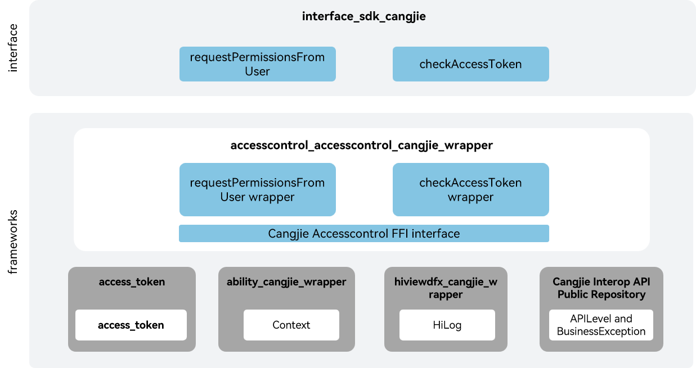

# accesscontrol_cangjie_wrapper(beta feature)

## Introduction

The accesscontrol_cangjie_wrapper is a Cangjie API encapsulated on OpenHarmony based on the access_token capability. The access_token information of the application mainly includes the application identity APPID, user ID, application clone index, application APL (Ability Privilege Level) level, application permission information, etc. The access_token information of each application is identified by a 32-bit unique device identifier, TokenID. Cangjie apis provides APIs for application permission management, including authentication and authorization. The currently accesscontrol Cangjie api only supports standard devices.

## System Architecture

**Figure 1** System architecture of accesscontrol_cangjie_wrapper



As shown in the architecture diagram:

interface: Provides APIs for developers.

- abilityAcessCtrl:
  - checkAccessToken: accesscontrol_cangjie_wrapper provides permission verification and management capabilities for applications. Developers can check whether an application has been authorized.
  - requestPermissions: Developers can request user authorization, and the result of this permission application will be returned.

frameworks:

- abilityAcessCtrl wrapper:
  - checkAccessToken wrapper: Encapsulates the checkAccessToken interface, providing developers with the ability to check whether an application has been authorized.
  - requestPermissions wrapper: Encapsulates the requestPermissionsFromUser interface, providing developers with the ability to request permissions from users.

Dependency Component Introduction in Architecture:

- access_token: It is responsible for providing basic functions of application access control, and encapsulates C interfaces to provide interoperability for Cangjie.
- hiviewdfx_cangjie_wrapper: Responsible for providing HiLog APIs, used for printing logs at critical paths.
- cangjie_ark_interop: Responsible for providing APILevel definitions, used for annotating APIs. Also provides the BusinessException exception class definition that is thrown to users.
- ability_cangjie_wrapper: Responsible for providing UIAbilityContext to the authorization interface for launching permission request dialogs to users.

## Directory Structure

The source code of the program access control is under base/accesscontrol/accesstrol_cangjie_wrapper

```
base/accesscontrol/accesscontrol_cangjie_wrapper
├── figures                       # architecture pictures
├── ohos                          # Cangjie program access control interface
│   ├── ability_access_ctrl       # Cangjie program access control management interface
│   └── security                  # Permission request result object
└── test                          # Cangjie test code
    └── ability_access_ctrl       # Cangjie AbilityAccessCtrl test code
```

## Usage Guidelines

The following features are provided:

  - The AbilityAccessCtrl module provides APIs for application permission management, including authentication and authorization. For relevant guidance, please refer to [Requesting User Authorization](https://gitcode.com/openharmony-sig/arkcompiler_cangjie_ark_interop/blob/master/doc/Dev_Guide/source_en/security/AccessToken/cj-request-user-authorization.md).


The following features are not provided yet:

  - Check the status of application permissions.
  - Displays a dialog box for setting a global swich.
  - Displays a permission settings dialog box to grant permissions the second time.


For Accesscontrol-related APIs, please refer to [ohos.ability_access_ctrl (Application Access Control Management)](https://gitcode.com/openharmony-sig/arkcompiler_cangjie_ark_interop/blob/master/doc/API_Reference/source_en/apis/AbilityKit/cj-apis-ability_access_ctrl.md). For relevant guidance, please refer to [Access Control Overview](https://gitcode.com/openharmony-sig/arkcompiler_cangjie_ark_interop/blob/master/doc/Dev_Guide/source_en/security/AccessToken/cj-access-token-overview.md).

## Code Contribution

Developers are welcome to contribute code, documentation, etc. For specific contribution processes and methods, please refer to [Code Contribution](https://gitcode.com/openharmony/docs/blob/master/en/contribute/code-contribution.md).

## Constraints

The following features are not provided yet:

  - Check the status of application permissions.
  - Displays a dialog box for setting a global swich.
  - Displays a permission settings dialog box to grant permissions the second time.

## Repositories Involved

[security_access_token](https://gitcode.com/openharmony/security_access_token)

[arkcompiler_cangjie_ark_interop](https://gitcode.com/openharmony-sig/arkcompiler_cangjie_ark_interop)

[ability_ability_cangjie_wrapper](https://gitcode.com/openharmony-sig/ability_ability_cangjie_wrapper)

[hiviewdfx_hiviewdfx_cangjie_wrapper](https://gitcode.com/openharmony-sig/hiviewdfx_hiviewdfx_cangjie_wrapper)
