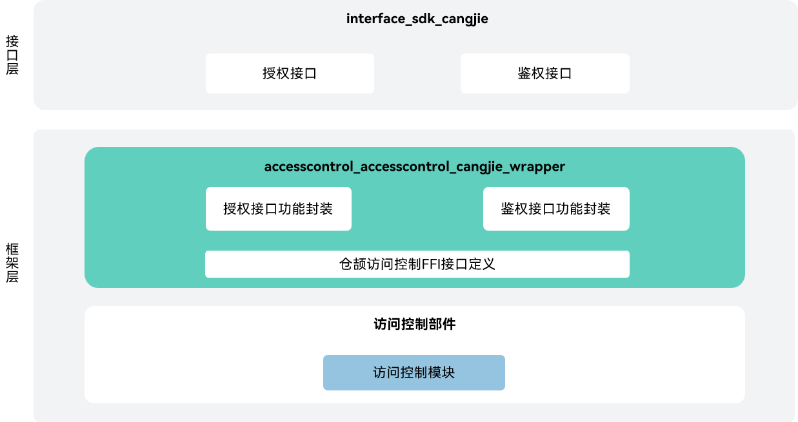

# 访问控制仓颉接口

## 简介

访问控制仓颉接口是在OpenHarmony上基于AccessToken能力之上封装的仓颉API。应用的Accesstoken信息主要包括应用身份标识APPID、用户ID、应用分身索引、应用APL(Ability Privilege Level)等级、应用权限信息等。每个应用的Accesstoken信息由一个32bits的设备内唯一标识符TokenID(Token identity)来标识。仓颉接口提供应用程序的权限校验、申请和管理能力。当前开放的访问控制仓颉接口仅支持standard设备。

## 系统架构

**图 1** 访问控制仓颉架构图



如架构图所示：

- 请求用户授权：开发者可调用requestPermissionsFromUser接口请求用户授权，并返回此次权限申请的结果。访问控制提供应用程序的权限校验和管理能力。
- 检验应用权限是否被授予： 开发者可通过checkAccessToken查看应用是否被授权。
- 仓颉访问控制FFI接口定义：负责定义C语言互操作仓颉接口，用于实现仓颉访问控制能力。
- 访问控制模块：负责提供访问控制基础功能，封装C语言接口提供给仓颉进行互操作。
- 元能力仓颉接口: 提供应用上下文，拉起弹窗请求用户授予权限。
- DFX仓颉接口：提供日志系统，使应用/服务可以按照指定级别、标识和格式字符串输出日志内容。
- 仓颉互操作API公共仓：提供仓颉标签与异常类的定义。

## 目录

访问控制仓颉源码在base/accesscontrol/accesstrol_cangjie_wrapper下

```
base/accesscontrol/accesscontrol_cangjie_wrapper
├── figures                 # 存放README中的架构图
├── ohos                    # 仓颉访问控制接口
│   ├── ability_access_ctrl # 仓颉访问控制管理接口
│   └── security            # 权限请求结果对象
└── test                    # 仓颉测试代码
```


## 使用说明

访问控制仓颉接口提供以下功能，开发者可以根据使用诉求，综合使用一类或多类接口：

  - 访问控制提供应用程序的权限校验和管理能力。开发者可通过提供的接口申请和查看应用权限。
  - 权限请求结果对象可以在用户调用requestPermissionsFromUser接口申请权限时返回此次权限申请的结果。


与ArkTS相比，暂不支持以下功能：

  - 查询应用权限状态。
  - 拉起全局开关设置。
  - 二次拉起权限设置弹窗。


访问控制相关API请参见[ohos.ability_access_ctrl（程序访问控制管理）](https://gitcode.com/openharmony-sig/arkcompiler_cangjie_ark_interop/blob/master/doc/API_Reference/source_zh_cn/apis/AbilityKit/cj-apis-ability_access_ctrl.md)，相关指导请参见[访问控制概述](https://gitcode.com/openharmony-sig/arkcompiler_cangjie_ark_interop/blob/master/doc/Dev_Guide/source_zh_cn/security/AccessToken/cj-access-token-overview.md)。

## 参与贡献

欢迎广大开发者代码，文档等，具体的贡献流程和方式请参见[参与贡献](https://gitcode.com/openharmony/docs/blob/master/zh-cn/contribute/%E5%8F%82%E4%B8%8E%E8%B4%A1%E7%8C%AE.md)。

## 相关仓

[security_access_token](https://gitcode.com/openharmony/security_access_token)

[arkcompiler_cangjie_ark_interop](https://gitcode.com/openharmony-sig/arkcompiler_cangjie_ark_interop)

[ability_ability_cangjie_wrapper](https://gitcode.com/openharmony-sig/ability_ability_cangjie_wrapper)

[hiviewdfx_hiviewdfx_cangjie_wrapper](https://gitcode.com/openharmony-sig/hiviewdfx_hiviewdfx_cangjie_wrapper)
