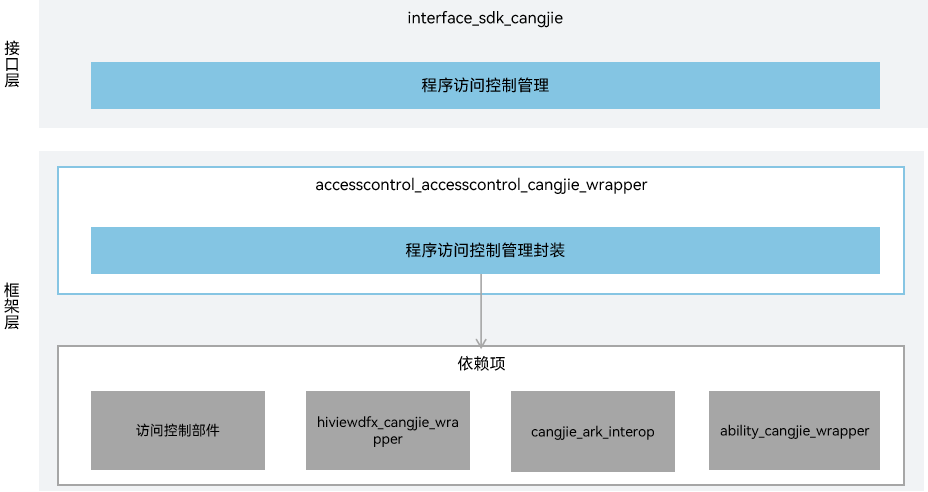

# 访问控制仓颉封装

## 简介

访问控制仓颉封装提供应用程序的权限校验、申请能力。当前开放的访问控制仓颉接口仅支持standard设备。

## 系统架构

**图 1** 访问控制仓颉架构图



如架构图所示：

接口层：

- 程序访问控制管理：包含鉴权接口和授权接口。
  - 鉴权接口：面向开发者提供的鉴权API，开发者可查看应用是否被授权。
  - 授权接口：面向开发者提供的授权API，开发者可请求用户授权，并返回此次权限申请的结果。访问控制提供应用程序的权限校验和管理能力。

框架层：

- 程序访问控制管理封装：为鉴权接口和授权接口的封装实现。
  - 鉴权接口功能封装：封装checkAccessToken接口，实现鉴权能力。
  - 授权接口功能封装：封装requestPermissionsFromUser接口，实现授权能力。

架构图中的依赖部件引入说明：

- 访问控制模块：负责提供访问控制基础功能，封装C语言接口提供给仓颉进行互操作。
- hiviewdfx_cangjie_wrapper：负责提供日志接口。访问控制仓颉封装依赖此部件用于在关键路径处打印日志。
- cangjie_ark_interop：负责提供仓颉注解类定义和BusinessException异常类定义。访问控制仓颉封装依赖此部件用于对API进行标注，及在错误分支向用户抛出异常。
- ability_cangjie_wrapper：负责提供UIAbility上下文给授权接口拉起弹窗请求用户授权。

## 目录

访问控制仓颉源码在base/accesscontrol/accesstrol_cangjie_wrapper下

```
base/accesscontrol/accesscontrol_cangjie_wrapper
├── figures                       # 存放README中的架构图
├── ohos                          # 仓颉访问控制接口
│   ├── ability_access_ctrl       # 仓颉程序访问控制管理接口
│   └── security                  # 权限请求结果对象
└── test                          # 仓颉测试代码
    └── ability_access_ctrl       # 仓颉访问控制管理接口测试代码
```


## 使用说明

访问控制仓颉接口提供以下功能，开发者可以根据诉求使用：

  - 访问控制提供应用程序的权限校验和管理能力。开发者可通过提供的接口申请和查看应用权限。相关示例请参见[向用户申请授权](https://gitcode.com/openharmony-sig/arkcompiler_cangjie_ark_interop/blob/master/doc/Dev_Guide/source_zh_cn/security/AccessToken/cj-request-user-authorization.md)。


访问控制相关API请参见[仓颉访问控制API文档](https://gitcode.com/openharmony-sig/arkcompiler_cangjie_ark_interop/blob/master/doc/API_Reference/source_zh_cn/apis/AbilityKit/cj-apis-ability_access_ctrl.md)，相关指导请参见[访问控制概述](https://gitcode.com/openharmony-sig/arkcompiler_cangjie_ark_interop/blob/master/doc/Dev_Guide/source_zh_cn/security/AccessToken/cj-access-token-overview.md)。

## 约束

与ArkTS提供的API能力相比，暂不支持以下功能：

  - 查询应用权限状态。
  - 拉起全局开关设置。
  - 二次拉起权限设置弹窗。

## 参与贡献

欢迎广大开发者代码，文档等，具体的贡献流程和方式请参见[参与贡献](https://gitcode.com/openharmony/docs/blob/master/zh-cn/contribute/%E5%8F%82%E4%B8%8E%E8%B4%A1%E7%8C%AE.md)。

## 相关仓

[security_access_token](https://gitcode.com/openharmony/security_access_token)

[arkcompiler_cangjie_ark_interop](https://gitcode.com/openharmony-sig/arkcompiler_cangjie_ark_interop)

[ability_ability_cangjie_wrapper](https://gitcode.com/openharmony-sig/ability_ability_cangjie_wrapper)

[hiviewdfx_hiviewdfx_cangjie_wrapper](https://gitcode.com/openharmony-sig/hiviewdfx_hiviewdfx_cangjie_wrapper)
